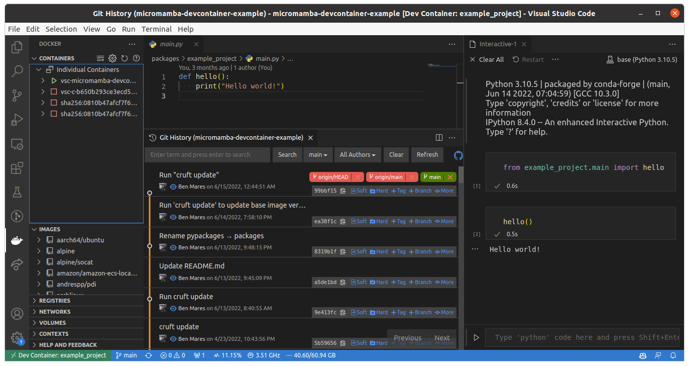

# micromamba-devcontainer

A general-purpose Micromamba-enabled VS Code development container image.

Save the time and effort of configuring development tools for each project × collaborator × device.

Featuring:

* Reproducible and isolated development environments "as code". 📄
* Runs [remotely](https://marketplace.visualstudio.com/items?itemName=ms-vscode-remote.remote-ssh) (e.g. from the cloud) just as well as locally. ☁️
* Several common tools (including Docker) are pre-installed with convenient defaults to minimize necessary configuration. 🐳

## Links

* [This micromamba-devcontainer on GitHub](https://github.com/maresb/micromamba-devcontainer)
* [Example development container](https://github.com/maresb/micromamba-devcontainer-example) for a Python project with Poetry
* [Micromamba Docker container](https://github.com/mamba-org/micromamba-docker) (parent image)
* VS Code [Developing inside a Container](https://code.visualstudio.com/docs/remote/containers) documentation
* VS Code [devcontainer.json reference](https://code.visualstudio.com/docs/remote/devcontainerjson-reference) documentation

## Getting started / Usage

### Quickstart

Refer to this [example](https://github.com/maresb/micromamba-devcontainer-example) and this corresponding [cookiecutter template](https://gitlab.com/bmares/cookiecutter-micromamba-devcontainer) for how this image can be used.

In short, if the [Remote - Containers](https://marketplace.visualstudio.com/items?itemName=ms-vscode-remote.remote-containers) extension installed in VS Code, you can clone the example repository and open it with VS Code.

You will then be prompted to reopen it in a container:

.

Upon reopening, VS Code will build the development Dockerfile if necessary, launch a container, install the VS Code backend inside, and configure everything according to the specification defined in `.devcontainer/devcontainer.json`.

The project folder will then open, mounted inside the container, and all installed extensions (e.g. Docker, Git History, and Jupyter) will be available:



### Details

The Dockerfile hosted in this repository is intended to be used as [the base image for the `dev.Dockerfile`](https://github.com/maresb/micromamba-devcontainer-example/blob/5b5965608a768cbff5854de476529ce9eaa071df/.devcontainer/dev.Dockerfile#L1) which is specified in [`devcontainer.json`](https://github.com/maresb/micromamba-devcontainer-example/blob/5b5965608a768cbff5854de476529ce9eaa071df/.devcontainer/devcontainer.json#L15).

To adapt this to your own project, your `dev.Dockerfile` should install development dependencies and initialize your project for development (for example by running `pip install --editable .` for Python a project).

## Introduction

This repository hosts the base image for a VS Code development container which comes with the following features to ease development:

* Micromamba via [`mambaorg/micromamba`](https://github.com/mamba-org/micromamba-docker).
* Ubuntu 22.04 (jammy).
* Sudo rights for the default user.
* Docker, Docker Compose and BuildKit installed for [use from within the container](#running-docker-from-docker).
* Basic command-line utilities from Ubuntu (e.g. `nano`, `git`, `less`, `man`, `htop`, `zip`, `jq`, `ping`).
* Configuration of Git, with some [helpful defaults](#git-pre-configured-for-ease-of-use)
* Can be used [remotely over SSH](https://marketplace.visualstudio.com/items?itemName=ms-vscode-remote.remote-ssh).

## Configuration

### Running "Docker from Docker"

If you want Docker to be accessible from within the development container, simply bind-mount `/var/run/docker.sock`.

In this case, any other containers started from within the development container will run *alongside* the development container.

It is recommended to install [Microsoft's VS Code Docker extension](https://marketplace.visualstudio.com/items?itemName=ms-azuretools.vscode-docker) within the development container.

### Git pre-configured for ease-of-use

Note that VS Code will automatically try to copy the user's Git configuration to the development container. This includes `user.name` and `user.email`, as well as GPG keys. To configure authenticated access to Git repositories via the SSH protocol, see [SSH agent](#ssh-agent).

The following have been set as system defaults within the container (`git config --system`):

* The default editor is `nano`.
* Pulling is configured with [fast-forward only](https://blog.sffc.xyz/post/185195398930), to avoid unexpected merge-conflict situations.
* The blame-ignore file is automatically configured to `.git-blame-ignore-revs` when it exists.
* The default branch name is `main`.

In addition,

* Git is ready for use with [pre-commit](https://pre-commit.com): newly created or cloned repositories will use pre-commit when both pre-commit is installed and a `.pre-commit-config.yaml` exists.)
* Git LFS comes pre-installed.

### SSH agent

VS Code can automatically forward your local SSH keys (e.g. for use with Git) to the development container (even when that development container is remote). Detailed instructions are [here](https://code.visualstudio.com/docs/remote/troubleshooting#_setting-up-the-ssh-agent).

The main steps are:

1. Make sure the SSH agent is running locally by opening a local terminal and listing your keys with `ssh-add -l`. (In case the agent is not running, follow the instructions in the above link.)
2. In case no keys are listed (`"The agent has no identities"`), add them by running `ssh-add`. (To instead add an individual key, run `ssh-add <path-to-key>`). Run `ssh-add -l` again to verify that the key was added.
3. Check if your keys are being forwarded to the container by opening an integrated terminal in the development container (`Ctrl`+`Shift`+``` ` ```) and running `ssh-add -l`. The results should agree with the local terminal.

## Troubleshooting

### Known issues

#### Extensions don't initialize at first

When extensions are installed for the first time after the container is started or rebuilt, there may be a series of warning notifications due to the extensions not initializing properly. They usually go away after reloading the window, either by clicking on one of the buttons, or by running the command `Ctrl+Shift+P` → `Developer: Reload Window`.

)]

#### Permission denied when multiple users run development containers on the same computer

This is a [known issue with VS Code](https://github.com/microsoft/vscode-remote-release/issues/2347). The precise error is:

```text
EACCES: permission denied, mkdir '/tmp/vsch
```

One solution is to log into the host machine and run

```bash
sudo chmod -R a+rwX /tmp/vsch
```

(This could reduce security and is recommended only when all the users are trusted.)

#### Permission denied while trying to connect to the Docker daemon socket

Check that your user within the devcontainer is a member of the `docker` group:

```bash
(base) mambauser@devcontainer:/workspaces/micromamba-devcontainer-example$ groups
mambauser sudo docker
```

It seems to happen occasionally that the user does not get added as a member of the Docker group, and I don't understand why. (Perhaps a race condition?) Try quitting all VS Code windows and rebuilding the container. Please create an issue if you have any insight.

### Unknown issues

If you encounter some other problem, please file [an issue](https://github.com/maresb/micromamba-devcontainer-example/issues) with this GitHub repository.
